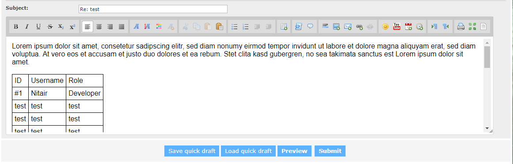
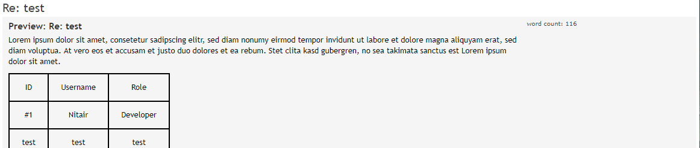

# WYSIWYG Editor for phpBB 3.2.x 

A simple WYSIWYG Editor for phpBB 3.1.x / 3.2.x which was created by nassim99. [Post from phpBB at Mar 28, 2015](https://www.phpbb.com/community/viewtopic.php?f=501&t=2307121)

### Editable textarea

### Preview

## How to install
* Just copy folder cosmo/ to {PHPBB_ROOT}/ext/

#### It should have following path:
* {PHPBB_ROOT}/ext/cosmo/sceditor/
	* config/
		* services.yml
	* event/
		* parser.php
		* sce.php
	* migrations/
		* bbcodedata.php
	* styles/
		* all/
			* template/
				* event/
					* overall_footer_after.html
					* overall_header_head_append.html
					* posting_editor_buttons_after.html
					* simple_footer_after.html
				* js/
					* languages/
						* ar.js
						* ca.js
						* cn.js
						* cs.js
						* de.js
						* el.js
						* en.js
						* en-gb.js
						* en-US.js
						* es.js
						* et.js
						* fa.js
						* fr.js
						* gl.js
						* hu.js
						* it.js
						* ja.js
						* it.js
						* nb.js
						* nl.js
						* pl.js
						* pt.js
						* pt-BR.js
						* ru.js
						* sv.js
						* template.js
						* tr.js
						* tw.js
						* uk.js
						* vi.js
					* themes/
						* images/
							* quote.gif
						* default.min.css
						* editarea.css
						* famfamfam.png
						* modern.min.css
						* office.min.css
						* office-toolbar.min.css
						* square.min.css
					* jquery.sceditor.bbcode.min.js
					* jquery.sceditor.default.min.css
					* sce.js
	* composer.json
	* license.txt

## Compatibility ##

* Originally extension was compatible to 3.1.x but you can use it for 3.2.x too (but its still testing)
* Tested with style "proflat"

## Special thanks to...
* Jörg from [Englisch-Hilfen](http://www.englisch-hilfen.de) who ordered the improvements for this extension and allowed me to make them Open Source.
