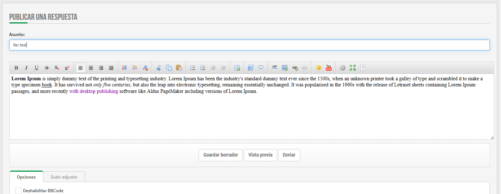

# WYSIWYG Editor for phpBB 3.2.x 

## How to install ##
* copy folder cosmo/ to {PHPBB_ROOT}/ext/

### It should have following path:
* {PHPBB_ROOT}/ext/
	* cosmo/
		* sceditor/

## Compatibility ##

* Originally extension was compatible to 3.1.x but you can use it for 3.2.x too (but its still testing)

## Special thanks to...
Jörg from [Englisch-Hilfen](http://www.englisch-hilfen.de) who ordered the improvements for this extension and allowed me to make them Open Source.
